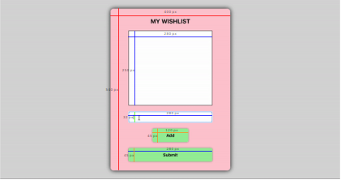
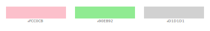

# New Developer Test: Wish List For Santa

For this assignment, I built a basic application using React and Redux that allows users to add items (strings) to a "wish list" and then submit the list (to Santa).

# Attributes 
## Dimension Deduction

Based on the initial dimensions given of the width and height of the main container, I analyzed the screenshot of the demo based on relative sizes, and deduced the dimensions of all the other elements. Where for the width of each element I did: 400*((width of element in picture)/(width of container in picture)), and applied a similar formula for the height.

## Color Palette 

Using a simple color picker tool, I deduced the 3 different colours used in the demo to ensure accuracy.

# Provided Instructions
## Demo

## Requirements
  * Clone the repository, and run `npm install` or  `yarn add` to set up your local environemnt.  When you are finished with your solution, push it to Github (please avoid including references to Halo in the repo title), and email Kevin to let him know you are finished so your work can be reviewed.

   

  * Items may not be blank strings nor duplicates of an item already on the list.
  * Clicking on an item in the list should remove it from the list.
  * Clicking the submit button should clear the wish list and create an alert that says 'Wish list submitted to Santa!'
  * User cannot submit if their wish list is empty.

     

  * Please complete the Redux reducer in redux > reducer.jsx.  (Adding and deleting items from the list should be handled by Redux.)  Do not add any new actions, as this is a part of the challenge.
  * Everything else regarding Redux has been done for you (i.e. store, actions, etc.) and can be found in the "redux" folder

   

  * Please give a reasonable effort to closely match the styling in the demo.  This task is meant to test your ability to create accurate, responsive components.  As a head start, the inner container's dimensions are 400px x 540px.  You do not need to worry about the font-family.

## Guidelines
  * Aside from styling and reducer.jsx, all code should be written inside of App.jsx.
  * React hooks are preferred to class components if you are comfortable with them.  If not, that is okay, too.
  * Use of Styled-Components is preferred, though you may use any other styling libraries (or none) that you are more comfortable with.

   

  * Make sure to write code that you would be comfortable contributing in a professional setting.  Cleanliness and maintainability are just as important as making sure that it actually works.
  * In total, this assignment shouldn't take more than an hour or two to complete.  It's just a quick way to get a better feel for where you are at, so don't spend your entire day on it.
  * If you get stuck, feel free to leave comments in the code explaining how you would go about completing that part instead.
